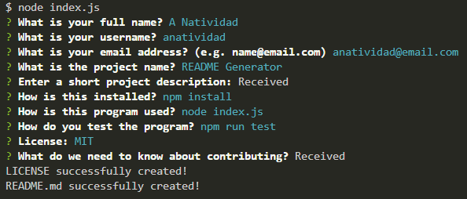
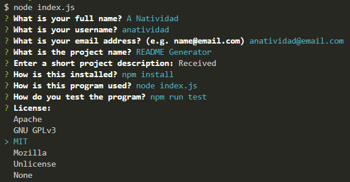
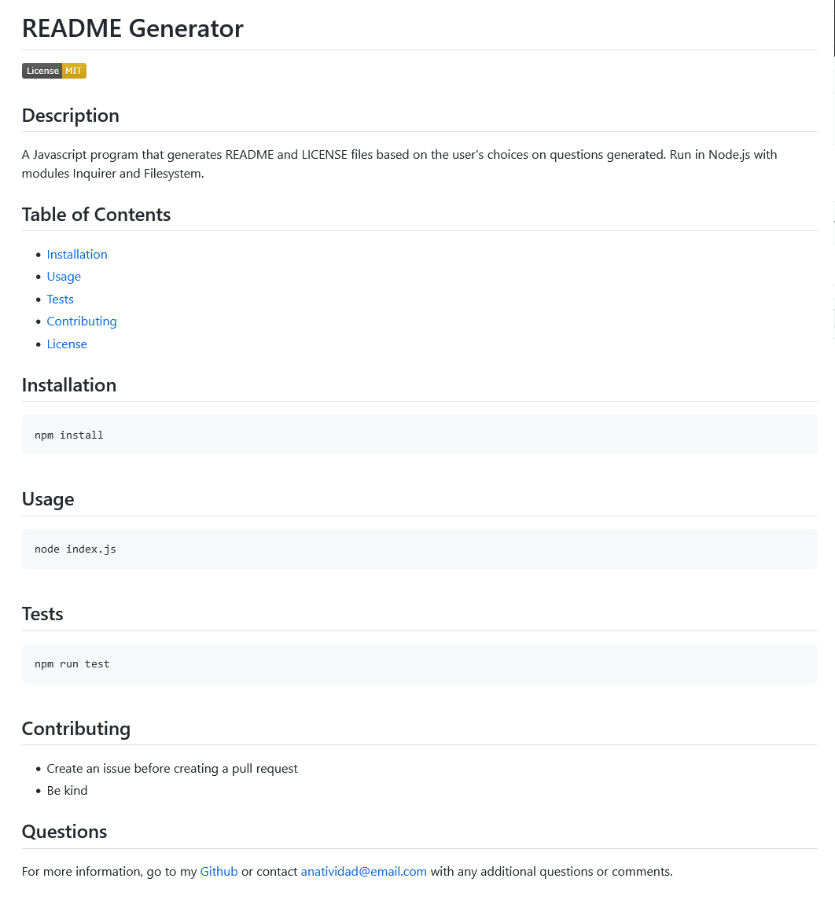
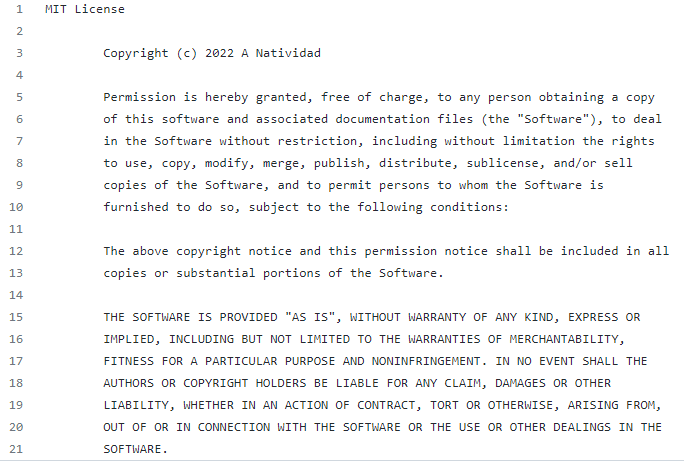

# README Generator

## Description

A Javascript program that generates README and LICENSE files based on the user's choices on questions generated by the program.

This program is ran using Node.js with modules Inquirer and Filesystem that handles the questions and their corresponding answers, and the writing of the files respectively.

### README file

The README file would consist of the following sections:

- Description
- Table of Contents
- Installation
- Usage
- License
- Contributing
- Tests
- Questions

The program is created so that a question is alloted and used for each section.


The Description and Contributing sections would be entered in the text file generated by Inquirer module instead of inline. The Table of Contents would have links to the other sections. Installation, Usage, and Tests sections would contain the code that needs to be run for the corresponding task. License would contain the license to grant permission to use, modify, and share the software created. Questions would contain the ways on where the user can be contacted and their Github repository. Aside from the sections mentioned, the user would also be asked the project's title, the user's full name, github username, and email that would be used for the title and questions sections.

### LICENSE file

The LICENSE file would be created if the user selects a license other than None and is generated based on the license selected.


## Demonstration/Sample File

The program is run in the command line and the user needs to answer questions that will be used to generate the README and LICENSE files.

https://user-images.githubusercontent.com/99376802/164706771-5741a3c2-ecdb-4e3b-b6c9-398f110240d5.mp4

### README sample file

The generated README file would look like below:



### LICENSE sample file

The generated LICENSE file would look like below:



## Installation

After forking the project, run the code below to install the modules needed to run this program:

```
npm install
```

## Usage

To run the program, run the code below:

```
node index.js
```
